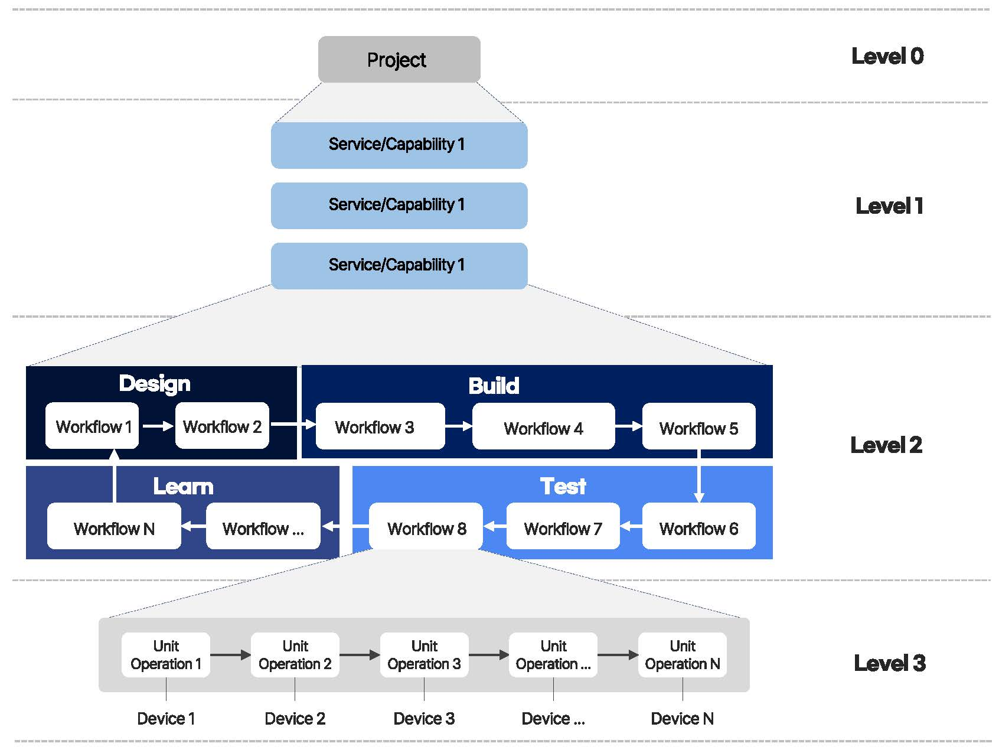

# Biofoundry Workflows

## Overview
- Due to differences in terminology, concepts, and scope among biofoundry researchers, there are limitations in utilizing physically/logically standardized automated equipment and software 
- Conceptually subdividing and structuring the processes required in biofoundries enables standardized execution and management of processes, thereby improving biofoundry performance
- We propose a 4-level abstraction hierarchy (Project, Service/Capability, Workflow, Unit Operation) to standardize biofoundries and streamline the DBTL cycle. This framework improves modularity, automation, and reproducibility while enabling better integration of AI tools, ultimately supporting a globally interoperable biofoundry network for collaborative synthetic biology. See [Biofoundry Abstraction Hierarchy](resources/Biofoundry_workflow_Abstraction_hierarchy_manuscript_v250605.pdf) and its [Supplement Information](resources/Biofoundry_workflow_Abstraction_hierarchy_suppl_v250605.pdf)

## Workflow Concepts
- Workflow: Defined as a logical, sequential flow of unit processes that can include part or all of the DBTL (Design-Build-Test-Learn) stages of experiments. Can be utilized as a basic unit for measuring biofoundry performance and developing automation levels.
- Unit Operation: The minimum unit process of experiments, where one unit operation is defined to correspond to one piece of equipment (UO) or one software (US)

## Purpose of This Repository
- Definition and management of workflows and unit operations
- Concept updates through opinion exchange

## Folder Structure
- `workflows` Contains types, definitions, and descriptions of workflows
- `unit-operations` Contains types, definitions, and descriptions of unit operations

## Providing Feedback
- Use the issue for opinions and discussions
